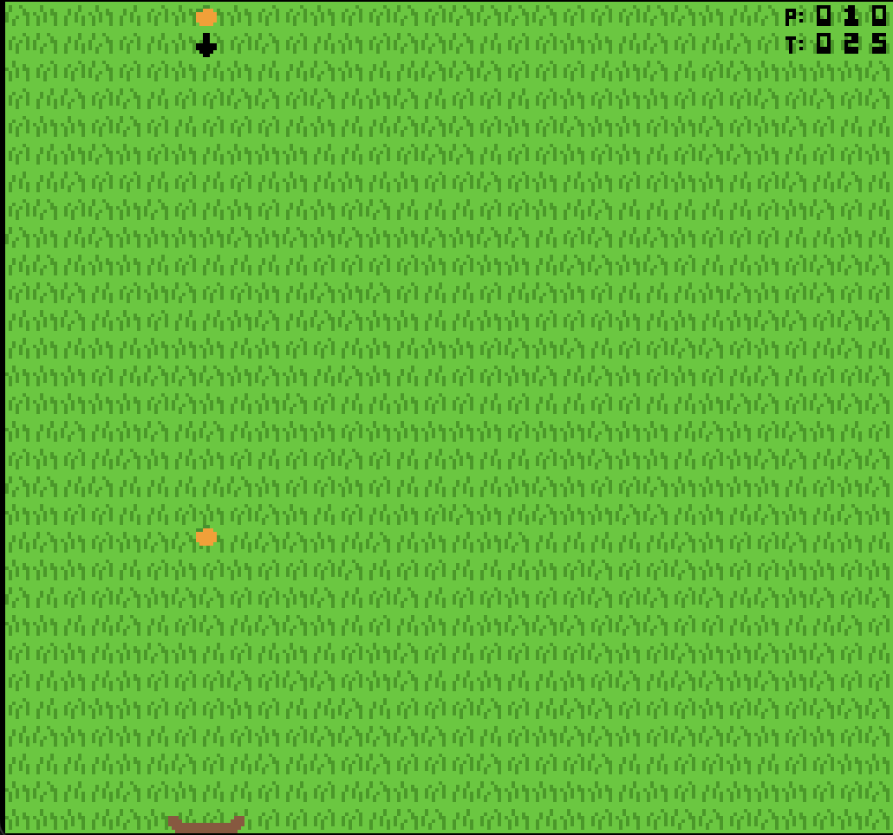

# FRUIT STORM

Author: Zhijian Wang

Design: Don't let them catch your fruit! Throw fruits for a minute to get more points from uncaught fruits.

Screen Shot:

How Your Asset Pipeline Works:

- Asset preparation: 
    - run `node MaekfileAssetPrep.js` to create [`/dist/asset_preparation`](/dist/asset_preparation) executable. The run the exe to preload all PNGs in `/dist` folder and save assets to [`dist/game.asset`](dist/game.asset).
    - Tiles and palette are read from PNG files, where each PNG consisting at most 4 colors and the width/height pixel multipliable by 8. The PNG parsing tool functions will first scan the PNG and create a palette, and use the palette to store tiles into the tile table in [`Sprites.hpp`](Sprites.hpp).
    - The background is simply a random distribution of four different grass tiles. It is generated after loading the PNGs and is also saved into `game.asset`.
- Upon executing the game, `game.asset` will load first, then the loaded tile table, palette table and the background (since it does not change in this game) will be uploaded to PPU466 during PlayMode init.
- The scene consists of a controllable player, a moving catcher, dropping fruits, and some number texts(made from sprites). Considering the small amount of game objects in the game, the scene is not loaded from asset file but built in runtime using the loaded tiles and palettes during PlayMode init in [`PlayMode.cpp`](PlayMode.cpp).
    - Some game objects (fruits) are added/removed during the gameplay.
    - Some game objects need to change sprites constantly (the fruit indicator, the timer and the score display).
    - The rendered sprites are gathered from the game object list in the scene before rendering and uploaded to PPU466.

PNG files and assets:

[Background](dist/background.png),
[Cherry and Watermelon](dist/fruits1.png),
[Orange and Banana](dist/fruits2.png),
[Player and Catcher](dist/characters.png),
[Number and Text](dist/nums.png),
[Game.asset file](dist/game.asset)

How To Play:

The player needs to control the fruit throwing position and determine which type of fruit to throw.

Fruits have different attributes:
- Cherry: normal speed, normal acceleration, short cooldown
- Watermelon: low speed, large acceleration, long cooldown (double score!)
- Orange: high speed, no acceleration, normal cooldown
- Banana: normal speed, small acceleration, normal cooldown

Control: LEFT/RIGHT to control the throwing position, UP/DOWN/SPACE to switch to another fruit. Fruits drop automatically.

The catcher (a bowl) will try to catch all the fruits coming down, but it is slow (at least compare to the player's speed). If the fruit is not caught by the bowl, the player will get points. The player has 60 seconds to try to get the highest point. Both the time and the point are shown on the top right of the screen.

This game was built with [NEST](NEST.md).

